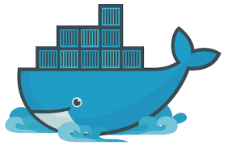
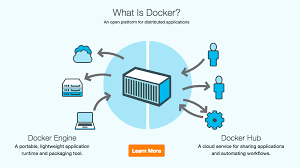
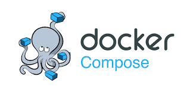
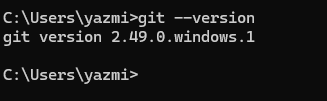
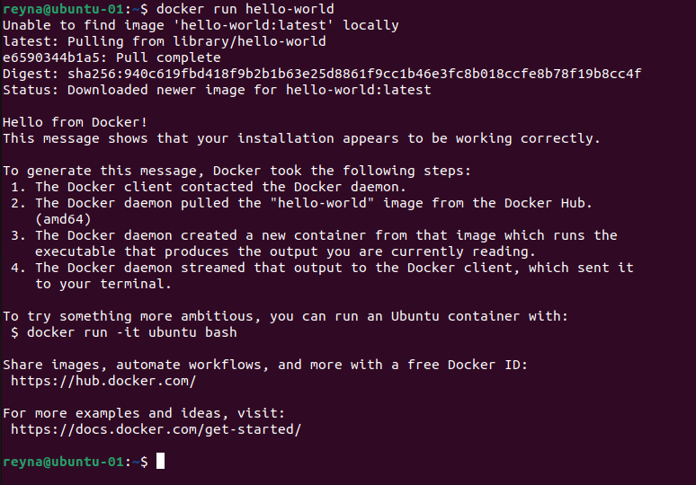
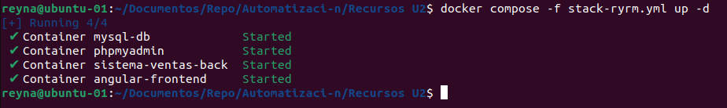
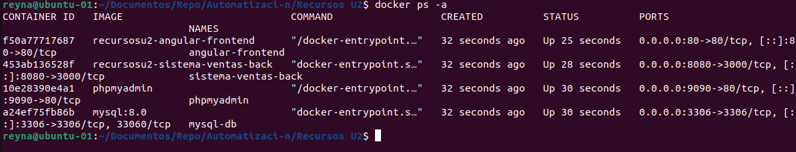

<p align="center">
  
</p> 
<p align="center">INGENIERÍA EN TECNOLOGÍAS DE LA INFORMACIÓN ÁREA REDES INTELIGENTES Y CIBERSEGURIDAD</p>
<p align="center">Automatización de Infraestructura Digital</p>
<p align="center">Unidad I. Entornos de desarrollo en la automatización de redes. </p>
<p align="center">Docente: Eric Domenzain Morales </p>
<p align="center">Actividad 1. Archivo README </p>
<p align="center">Autor: Reyna Yazmin Ríos Martínez</p>
<p align="center">GIRI5091</p>
<p align="right">Dolores Hidalgo C. I.N., Gto a 12 de junio de 2025</p>

<h1 align="center"> Actividad 1. Archivo README </h1> 

# Índice
1. [Introducción](#introducción)
2. [Docker](#docker)
    - [Docker Engine](#docker-engine)
    - [Docker Compose](#docker-compose)
    - [Docker Swagger](#docker-swagger)
3. [Instalación técnica de docker](#instalación-técnica-de-docker)
    - [Instalación](#instalación)
    - [Requistos previos](#requisistos-previos)
    - [Comandos Básicos](#comandos-básicos)
        - [Crear imagen a partir de un archivo Dockerfile](#crear-imagen-a-partir-de-un-archivo-dockerfile)
        - [Levantar un contenedor a partir de una imagen](#levantar-un-contenedor-a-partir-de-una-imagen)
4. [Instalación técnica de VSCode](#instalación-técnica-de-vscode)
    - [¿Qué es VSCode?](#qué-es-vscode)
    - [Pasos a seguir](#pasos-a-seguir)
5. [Instalación técnica de Git](#instalación-técnica-de-git)
    - [¿Qué es Git?](#qué-es-git)
    - [Instalación en Ubuntu/Linux](#instalación-en-ubuntulinux)
    - [Instalación en Windows](#instalación-en-windows)
6. [Ejecutar la imagen hello-world en Docker](#ejecutar-la-imagen-hello-world-en-docker)
    - [Objetivo](#objetivo)
    - [¿Qué hace este comando?](#qué-hace-este-comando)
      - [Si la imagen no está en tu sistema...](#si-la-imagen-no-está-en-tu-sistema)
    - [Resultado esperado:](#resultado-esperado)
7. [Ejecutar un archivo “.YML”](#ejecutar-un-archivo-yml)
    - [¿Qué es un archivo .yml?](#qué-es-un-archivo-yml)
    - [Comando](#comando)
      - [Explicación](#explicación)
      - [Resultado esperado de Docker Compose](#resultado-esperado-de-docker-compose)
    - [Verifica que los contenedores están corriendo](#verifica-que-los-contenedores-están-corriendo)
      - [Resultado esperado de Contenedores](#resultado-esperado-de-contenedores)
8. [Conclusión](#conclusión)
9. [Bibliografía](#bibliografía)

# Introducción
<p style="text-align: justify;">
  La automatización de redes es un pilar fundamental en la gestión de entornos tecnológicos modernos, permitiendo una mayor eficiencia, menor margen de error y mejor administración de recursos. Este reporte detalla el procedimiento de instalación y configuración de las herramientas necesarias para implementar flujos de automatización, incluyendo la preparación de un entorno de desarrollo funcional.
  En particular, se abordan las herramientas <strong>Docker Engine</strong>, <strong>Docker Compose</strong> y <strong>Docker Swagger</strong>, ampliamente utilizadas para la creación y orquestación de contenedores, junto con el uso de <strong>Visual Studio Code</strong> como editor de código y otros complementos esenciales.  
  El reporte incluye la descripción de cada herramienta, la instalación técnica paso a paso de las dependencias y entornos necesarios (como Git y plugins de VS Code), así como la ejecución de pruebas de verificación para asegurar el correcto funcionamiento de cada componente.  
  Además, se muestran evidencias gráficas que sustentan la realización de cada paso y los resultados obtenidos, garantizando la transparencia del proceso.  
  Finalmente, se expone una conclusión que recopila los hallazgos más importantes y se presenta una bibliografía en estilo APA7, la cual recopila los recursos de la comunidad de colaboración y referencias académicas consultadas.  
  Este reporte busca demostrar la comprensión y dominio del procedimiento, así como dejar un registro claro y ordenado para futuras implementaciones o consultas.
</p>


# Docker 

<p align="center">
  
</p>

## Docker Engine
<p style="text-align: justify;">
Docker Engine es una plataforma de contenedores liviana que permite desarrollar, empaquetar y ejecutar aplicaciones en entornos aislados llamados contenedores. Es el componente central del ecosistema Docker.
</p>

<p align="center">
  
</p>

## Docker Compose
<p style="text-align: justify;">
Docker Compose es una herramienta oficial de Docker que permite definir y ejecutar múltiples contenedores de forma simultánea mediante un archivo de configuración YAML. Es ideal para entornos donde varias aplicaciones o servicios deben correr juntas, como bases de datos, servidores web y backends.
</p>

<p align="center">
  
</p>

## Docker Swagger
<p style="text-align: justify;">
Swagger (ahora parte del ecosistema OpenAPI) es una herramienta que permite documentar, diseñar, visualizar y probar APIs RESTful de forma interactiva. Combinado con Docker, puedes levantar rápidamente una interfaz gráfica para visualizar y probar tu API sin necesidad de instalar Swagger localmente.
</p>

<p align="center">
  
</p>

# Instalación técnica de docker.
### Instalación
Ir a https://docs.docker.com/engine/install/ubuntu/ y seguir las instrucciones.
## Requisistos previos
- Sistema operativo: Ubuntu 20.04 / 22.04 (o similar).
- Privilegios de administrador (sudo).
- Conexión a internet.

1. Eliminar versiones antiguas (opcional, pero recomendado)
 ``` shell
sudo apt remove docker docker-engine docker.io containerd runc
```

2. Actualizar el sistema y paquetes requeridos
 ``` shell
sudo apt update
sudo apt install ca-certificates curl gnupg lsb-release
```

3. Agregar la clave GPG oficial de Docker
 ``` shell
sudo mkdir -p /etc/apt/keyrings
curl -fsSL https://download.docker.com/linux/ubuntu/gpg | \
sudo gpg --dearmor -o /etc/apt/keyrings/docker.gpg
```

4. Agregar el repositorio de Docker
 ``` shell
echo \
  "deb [arch=$(dpkg --print-architecture) \
  signed-by=/etc/apt/keyrings/docker.gpg] \
  https://download.docker.com/linux/ubuntu \
  $(lsb_release -cs) stable" | \
  sudo tee /etc/apt/sources.list.d/docker.list > /dev/null
```

5. Instalar Docker Engine y herramientas asociadas
 ``` shell
sudo apt update
sudo apt install docker-ce docker-ce-cli containerd.io docker-buildx-plugin docker-compose-plugin
```

6. Verificar que Docker funciona correctamente
 ``` shell
sudo docker run hello-world
```
Deberías ver un mensaje como: **"Hello from Docker! This message shows that your installation appears to be working correctly."**

Linux mint:
https://www.linuxtechi.com/how-to-install-docker-on-linux-mint/

## Comandos Básicos
Lista de comandos basicos de docker

- **Listar las imagenes disponibles en el sistema**
 ``` shell
 docker ps -a
```

- **Inicializar un contenedor:** 
 ``` shell
docker start [nombre o ID]
```

- **Ver los Logs de los contenedores:** 
 ``` shell
docker logs [nombre contenedor]
```

- **Detener los contenedores:** 
 ``` shell
docker stop [nombre contenedor]
```

- **Eliminar un contenedor:** 
``` shell
docker rm [nombre o ID]
```

- **Eliminar una imagen:** 
``` shell
docker image rm [nombre o ID]
```

### Crear imagen a partir de un archivo Dockerfile
``` shell
docker buil -t nameapp:tag --no-cache --build-arg JAR_FILE=target/*.jar .
```

### Levantar un contenedor a partir de una imagen
``` shell
docker run -p 80:80 -p 8080:8080 --name containername
```

# Instalación técnica de VSCode
## ¿Qué es VSCode?
<p style="text-align: justify;">
Visual Studio Code (VSCode) es un editor de código fuente desarrollado por Microsoft, muy usado para programar y trabajar con tecnologías como Docker, Git, Node.js, Python, etc. Es ligero, extensible y compatible con Linux, Windows y macOS.
</p>

## Pasos a seguir
1. **Actualiza los repositorios e instala dependencias:**
``` shell
sudo apt update
```
``` shell
sudo apt install wget gpg apt-transport-https
```

2. **Agrega la clave GPG de Microsoft:**
``` shell
wget -qO- https://packages.microsoft.com/keys/microsoft.asc | gpg --dearmor > packages.microsoft.gpg
sudo install -o root -g root -m 644 packages.microsoft.gpg /etc/apt/keyrings/
```

3. **Agrega el repositorio de VSCode:**
``` shell
sudo sh -c 'echo "deb [arch=amd64 signed-by=/etc/apt/keyrings/packages.microsoft.gpg] https://packages.microsoft.com/repos/code stable main" > /etc/apt/sources.list.d/vscode.list'
```

4. **Instala VSCode:**
``` shell
sudo apt update
sudo apt install code
```

5. **Verifica instalación:**
``` shell
code --version
```
# Instalación técnica de Git
## ¿Qué es Git?
<p style="text-align: justify;">
Git es un sistema de control de versiones distribuido, utilizado para rastrear cambios en archivos de código fuente, coordinar el trabajo en equipo y gestionar versiones de proyectos de software. Es fundamental para trabajar con plataformas como GitHub.
</p>

## Instalación en Ubuntu/Linux

1. **Actualizar los repositorios**
``` shell
sudo apt update
```

2. **Instalar Git**
``` shell
sudo apt install git
```

3. **Verificar instalación**
``` shell
git --version
```
Deberías ver algo como:
``` shell
git version 2.34.1
```

## Instalación en Windows

1. Descargar Git para Windows
    - Ir al sitio oficial: https://git-scm.com/download/win
    - El instalador se descarga automáticamente.
2. Ejecutar el instalador
    - Haz doble clic en el archivo **.exe.**
    - Acepta los valores por defecto, especialmente:
        - Editor predeterminado: VSCode (si está instalado).
        - PATH: selecciona "Git from the command line and also from 3rd-party software".
    - Finaliza la instalación.
3. Verificar instalación
    - Abre PowerShell o CMD:
    ``` shell
    git --version
    ```
<p align="center">
  
</p> 

# Ejecutar la imagen hello-world en Docker
## Objetivo:
Verificar que Docker Engine está instalado, el daemon está corriendo correctamente y tienes permisos suficientes para usarlo.

1. **Ejecutar el comando**
    - Abre una terminal y escribe:
    ``` shell
    docker run hello-world
    ```

### ¿Qué hace este comando?
  - **docker run:** Instruye a Docker a crear y ejecutar un contenedor.
  - **hello-world:** Es una imagen de prueba mínima oficial que imprime un mensaje simple.

### Si la imagen no está en tu sistema...
Docker descargará automáticamente la imagen **hello-world** desde Docker Hub:
``` shell
Unable to find image 'hello-world:latest' locally
latest: Pulling from library/hello-world
...
```

## Resultado esperado:
Si Docker está funcionando, verás un mensaje como este:
``` shell
Hello from Docker!
This message shows that your installation appears to be working correctly.
...
```
<p align="center">
  
</p> 


# Ejecutar un archivo “.YML”

## ¿Qué es un archivo .yml?
<p style="text-align: justify;">
Un archivo .yml (YAML) define la configuración de uno o varios contenedores Docker usando Docker Compose, que permite lanzar servicios completos (como bases de datos, aplicaciones web, APIs, etc.) de manera sencilla.
</p>

## Comando 
``` shell
docker compose -f stack-rmr.yml up -d
```

### Explicación:
  - -f: especifica el archivo YAML a usar.
  - up: inicia los servicios.
  - -d: modo detached (en segundo plano).

### Resultado esperado de Docker Compose
<p align="center">
  
</p> 

## Verifica que los contenedores están corriendo
``` shell
docker ps -a
```

### Resultado esperado de Contenedores
<p align="center">
  
</p> 

# Conclusión 
<p style="text-align: justify;">
Durante el desarrollo de esta unidad, se logró implementar exitosamente un entorno de automatización de redes utilizando herramientas modernas como Docker Engine, Docker Compose y Swagger UI. La instalación técnica de herramientas clave como Visual Studio Code, Git y Docker fue documentada paso a paso, lo que permitió establecer una base sólida para la creación y gestión de contenedores de forma eficiente.
</p>
<p style="text-align: justify;">
Se realizaron pruebas prácticas para verificar el funcionamiento correcto del entorno, como la ejecución de la imagen hello-world, la creación y despliegue de contenedores mediante archivos docker-compose.yml, así como la construcción de imágenes personalizadas usando Dockerfile tanto para el backend como para el frontend de una aplicación web. Estas prácticas permitieron comprender mejor el flujo de trabajo en entornos contenedorizados y facilitaron la visualización y prueba de servicios API mediante Swagger.
</p>
<p style="text-align: justify;">
Uno de los hallazgos más relevantes fue reconocer la ventaja que ofrece Docker para separar servicios en contenedores independientes, facilitando el mantenimiento, escalabilidad y portabilidad de los proyectos. Además, el uso de Git como sistema de control de versiones y su integración con GitHub permitió gestionar los cambios del proyecto de forma organizada y colaborativa.
</p>
<p style="text-align: justify;">
En resumen, este trabajo permitió aplicar conocimientos técnicos de forma práctica y desarrollar habilidades fundamentales para la administración de infraestructura digital moderna, lo que representa un paso importante hacia la profesionalización en entornos DevOps y de redes inteligentes.
</p>

# Bibliografía

    “Ubuntu.” (2025, May 21). Docker Documentation. https://docs.docker.com/engine/install/ubuntu/

    Kumar, P. (2024, October 20). How to install Docker on Linux Mint 22 or 21 Step-by-Step. LinuxTechi.
        https://www.linuxtechi.com/how-to-install-docker-on-linux-mint/

    Ratliff, S. (2025, May 30). Docker: Accelerated Container Application Development. 
        Docker. https://www.docker.com/